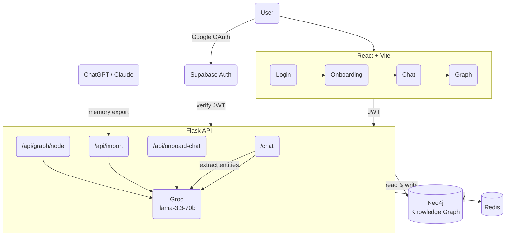

# Identiti

Your memory lives here. Chat with an AI that knows who you are — and builds your knowledge graph as you talk.

## Architecture



## Stack

| Layer | Tech |
|-------|------|
| Frontend | React + Vite, canvas graph renderer |
| Backend | Flask (Python) |
| Auth | Supabase (Google OAuth) |
| LLM | Groq — llama-3.3-70b via litellm |
| Graph DB | Neo4j |
| Cache | Redis (conversation history) |

## Where AI is called

| Endpoint | Purpose |
|----------|---------|
| `/chat` | Generate replies using memory context |
| `/chat` (post-reply) | Extract entities from conversation → graph nodes |
| `/api/onboard-chat` | Onboarding conversation → profile JSON |
| `/api/import` | Parse memory export → structured profile |
| `/api/graph/node` | Normalize user-typed labels (spelling correction) |
| `/api/wallet` | (reads graph, no LLM) |

## Run it

```bash
python3 app.py
# open http://localhost:3000
```

## Env vars

```
GROQ_API_KEY
LLM_MODEL          # default: groq/llama-3.3-70b-versatile
NEO4J_URI
NEO4J_USER
NEO4J_PASSWORD
NEO4J_DATABASE
SUPABASE_URL
SUPABASE_JWT_SECRET
REDIS_URL           # optional
```
